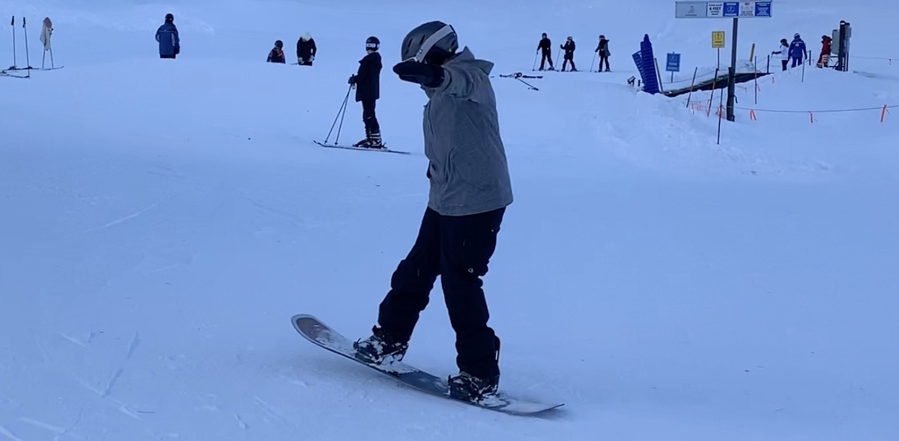

👋 I'm Jesse! I'm a software engineer (still 😊) in the San Francisco Bay Area. But, don't take my word for it! Here is what ChatGPT has to say about me:

> Meet Jesse Bounds, a software engineer by day and aspiring stand-up comedian by night. With a natural talent for making people laugh, Jesse's wit and humor are not only present in his code comments but also in his jokes on stage. When he's not coding, Jesse loves exploring the beautiful Bay Area, trying out new restaurants, and indulging in his favorite TV shows. He also enjoys playing guitar, reading sci-fi novels, and experimenting in the kitchen, even though his culinary skills are a work in progress. Despite his whimsical personality, Jesse is serious about his work and strives to create software that is both functional and user-friendly. If you need a good laugh or help with your latest coding project, don't hesitate to reach out to Jesse on his website.

