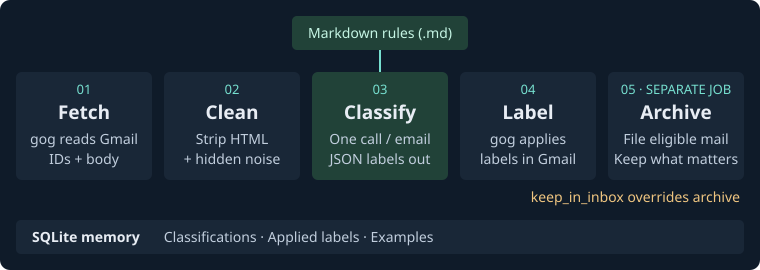
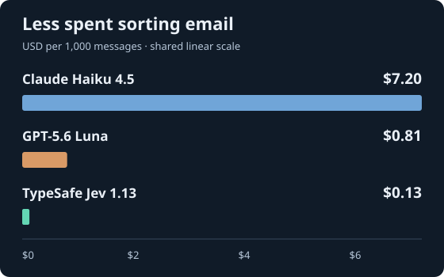
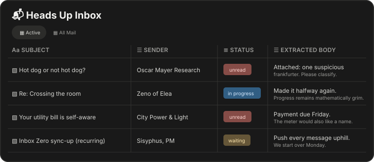

To cross a room, the Greek philosopher [Zeno said](https://en.wikipedia.org/wiki/Zeno%27s_paradoxes#Dichotomy_paradox), you must first cross half of it, then half of what’s left, forever. That perfectly describes my experience using email for decades now. And that’s grim! So, I’ve stopped using an email client and delegated this chore to Notion, agents, and [TypeSafe’s Jev](https://typesafe.ai/).

I start each day with an inbox that’s mostly empty: messages are properly labeled and archived, leaving only those that need my attention. Or, at least, the attention of [Notion Custom Agents](https://www.notion.com/product/agents)! (Disclaimer: I work at Notion.)

Recently, I learned about Jev, a model from TypeSafe that answers structured questions with categories and probabilities. I put Jev in charge of email label classification. It has greatly improved accuracy and reduced costs from \$7.20 to \$0.13 per 1,000 messages, roughly a fiftyfold improvement. It’s been an interesting journey, and I want to share more about how I built it.

## 🌱 Why I built this

My goal was clear: I wanted a fully automated inbox-zero system that classified, labeled, and archived my email. I wanted to move beyond old-fashioned email clients and treat email as another connected data stream. One I could use in [Notion](https://www.notion.com/), [Grok Bot](https://grok.com/), [Muse](https://muse.ai/), and whatever other systems helped me make sense of it.

I started in May 2026 and built the original version with Codex. That system had all the key components that still exist today, but with different backing models:

- **Email classifier and label stamper** backed by Haiku 4.5: in the beginning, it used one giant prompt with 13 prose rules mapped to Gmail labels
- **Correction monitor and rule auditor** backed by Sonnet: this component checked for label edits made by me or my agents, identified those that represented corrections, and updated the rule Markdown files to improve future classification

The interface was a handful of commands, run on a schedule:

```bash
# Classify new email and apply labels
inboxz scan

# Detect label corrections and update the rules
inboxz scan --learn-only

# Archive messages whose rules allow it
inboxz archive
```

## ⚙️ The classifier and label pipeline

The classifier runs on a regular schedule via launchd on a Mac mini. To interact with Gmail, it uses [gog](https://gogcli.sh/), a Go CLI that handles authentication and provides the data the system needs.

The pipeline works like this:

- Use gog to fetch email message IDs and body content, then strip scripts, styles, invisible characters, and other noise
- Run the classifier once per email: one inference call in, one JSON blob of labels out
- Use gog to apply those labels to the message
- Let the archive job file away anything whose rule says archive, unless it also says keep_in_inbox. That exception is how important messages, such as utility bills, survive the purge
- Store the system's memory in SQLite: which emails have already been classified (so none is classified or billed twice), which labels it applied (so it can detect when I move a message), and the example emails the learner has collected

<picture>
  <source media="(max-width: 600px)" srcset="pipeline-infographic-mobile.svg">
  
</picture>

Each rule was a Markdown file. Its frontmatter specified the Gmail label and whether messages should be archived, kept in the inbox, or marked as read. Its prose body told the model what belonged under that label. Because the rules lived in git, every change the system made became a commit that my agents and I could review or revert.

The classifier used one giant prompt containing all 13 rules and up to ten example emails per rule. By September, that prompt had grown to about 26,000 tokens. The user message contained only the cleaned email, and the model returned the applicable labels as JSON. Guided by the rule prose, the model made every classification decision.

The correction monitor handled learning. Over a rolling 14-day window that included archived mail, it compared Gmail’s current labels with those recorded in SQLite. When I changed a label, it treated the change as a correction. The rule auditor then rewrote the relevant rule and committed the update, including its reasoning in the commit message.

The design mostly worked, but two problems kept growing. First was cost: every accepted lesson added another example to the cached prompt, and every email paid to read all 26,000 tokens (although prompt caching helped). Second was drift: prose rules were imprecise, so the system sometimes relearned the same lesson in slightly different words. Jev helped address both problems, as we'll see shortly.

## 💸 Cost efficiency

Over the next few months, things mostly just worked. Classification and labeling were not always accurate, but the correction system kept the results on track. My main disappointment was the cost: more than \$20 per month.

The first significant improvement came in August, when I switched to [OpenAI models](https://openai.com/). The decision to keep providers interchangeable paid off: OpenAI was already wired in, so enabling it required only a configuration change. GPT-5.6 Terra became the rule rewriter at low reasoning, while GPT-5.6 Luna took over classification.

On a matched 40-message sample, Luna cost about \$0.81 per 1,000 messages, compared with Haiku's \$7.20. With the same rules and labels, the OpenAI setup reduced costs by roughly ninefold in this system. Even with Luna's price benefit, the classifier still reads the entire rule book for every email, and the rule book continued to grow. I needed a cheaper approach. I might have tried training a model, but then I discovered a new option worth testing.

## 🧠 How Jev classifies email

That option was [TypeSafe's Jev](https://typesafe.ai/).

Jev never sees the rule book. Instead of asking one model “which of my 13 rules apply to this email?”, the classifier now asks ten small, fixed questions about every message: one multiple choice (what kind of mail is this, out of 21 options like bill, promotion, or recruiting) plus nine yes-or-no facts, such as *is this a utility bill?* or *is this a calendar invite?* Jev's only job is to describe the email. A few dozen lines of Python turn those answers into Gmail labels.

In simplified Python, the request looks like this. The question wording is shortened here; authentication, validation, and retries are omitted:

```python
questions = {
    "kind": {
        "type": "choice",
        "instructions": "What kind of email is emails[0]?",
        "criteria": MAIL_KINDS,  # 21 named kinds and their descriptions
    },
}

for name, question in NINE_FACT_QUESTIONS.items():
    questions[name] = {
        "type": "noul",  # A yes/no question that returns P(true)
        "instructions": f"For emails[0]: {question}",
        "criteria": {
            "true": "The condition holds.",
            "false": "The condition does not hold.",
        },
    }

# One request contains the email and all ten typed questions.

response = httpx.post(TYPESAFE_ENDPOINT, json={
    "model": "jev-1.13.0",
    "state": {"emails": [cleaned_email]},
    "questions": questions,
})

# Jev returns one category and nine probabilities.

# Our Python code deterministically turns those judgments into labels.

labels = compose_labels(response.json()["answers"])

# Example: {"bills", "heads-up"}
```

Jev might classify a utility notice as a bill with 97% probability and give “this contains a personal deadline” a Noul value of 0.94. It does not choose the Gmail labels itself. The system’s Python code interprets those typed judgments: the bill kind produces `Bills`, while the deadline fact adds `Heads Up`.

The probability shows how confident Jev is, which lets the system use different levels of certainty for different actions. A personal deadline scored at `0.94` can confidently add `Heads Up`. A borderline result might look like this:

```json
"personal_deadline": {
    "type": "noul",
    "noul": 0.52
}
```

Here, Jev thinks “yes” is only slightly more likely than “no.” It does not mean that the email contains “52% of a deadline.” The system currently uses `0.5` as its threshold, so this result would add `Heads Up`, but retaining the probability gives me room to make the system more cautious later. For example, I could require `0.8` before adding an urgent label or send borderline cases for review.

This also gave me more control over mistakes the old classifier kept making. A sale ending tomorrow could look like something that needed my attention. Now, once Jev identifies it as a promotion, the code keeps it out of Heads Up. I can test that behavior directly.

On a fixed 40-message sample, Jev produced the exact label set 37 times, compared with Luna's 28. Jev costs about \$0.13 per 1,000 messages, versus \$0.81 for Luna and \$7.20 in the Haiku production measurement. At 200 emails a day, Jev classifies my email for roughly 78 cents a month. Learning now means paired proposals (new rule prose plus new question wording) regression-tested against the correction and all stored examples.

<figure style="max-width: 560px; margin: 1.5rem auto;">
  <picture>
    <source media="(max-width: 480px)" srcset="classification-cost-mobile.svg">
    
  </picture>
  <figcaption>Costs at listed rates: Haiku’s 89-message production scan with the full rule book; Luna and Jev on the same 40-message sample.</figcaption>
</figure>

## 📬 Notion as my email client

I said I had [stopped using email clients](https://www.notion.com/help/notion-mail-inbox-is-going-away-what-to-do-next), but that isn’t entirely true. Messages that need my attention are synced to a Notion database that serves as a client UI and it’s far more powerful than a traditional inbox. I can see the classics, such as the sender and subject, along with the rendered email for each thread. Other agents can also extract tasks, prepare or pay bills, and draft replies for certain categories of email.

<figure style="max-width: 760px; margin: 1.5rem auto;">
  <picture>
    <source media="(max-width: 600px)" srcset="notion-inbox-mock-mobile.svg">
    
  </picture>
  <figcaption>A simplified mock of the Notion database that serves as my email client.</figcaption>
</figure>

The labeling run uses the Notion CLI to create and update database rows. That script also uses the [`ntn` CLI](https://developers.notion.com/cli/get-started/overview) to start a session with a Custom Agent connected to Notion Mail and my Gmail account. The agent finds the Gmail thread and adds or refreshes the rendered email block in the row’s page body. Lastly, archiving a row in Notion also archives the corresponding Gmail thread during the next sync, another step toward that fool’s errand of reaching inbox zero or crossing Zeno’s room.

Now my inbox is simply another data source connected to my agents at a price even I can afford. I get mostly signal, not noise, while retaining the important “taste” decisions that only humans can make.


