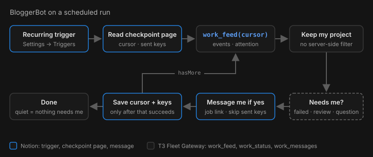

<figure style="max-width: 760px; margin: 1.5rem auto;">
  
  <figcaption>Mission control, on loop: one ask in Notion, three jobs across two machines, three PRs back.</figcaption>
</figure>

I work at Notion, so of course I want it to be the interface for my agent fleet, the way Grok Bot was in [my last post](). Blogging is a great place to start. Between MCP and Notion's other connectors, Notion is the center of all my project work, so an agent there already knows what I've been building and what's worth writing about.

I made a Notion Custom Agent called BloggerBot that uses the same [T3 Fleet Gateway](https://github.com/boundsj/t3-fleet-gateway): Notion is the interface, and T3 manages the agent threads.

(Yes, BloggerBot had a hand in this one too.)

## What Notion brings

- **Context.** My project pages and connectors.
- **Tools.** One Custom MCP server connection, each tool toggled on or off.
- **Triggers.** A recurring schedule, so it checks on jobs unasked.
- **Memory.** A page as its checkpoint between runs.

## How I did it

<figure style="max-width: 760px; margin: 1.5rem auto;">
  
  <figcaption>Connect the T3 MCP tool to a Notion Custom Agent, ask for something, a T3 thread does the work, and a PR shows up.</figcaption>
</figure>

### 1. Set up the gateway and a token

Give a coding agent on the always-on T3 Code machine this prompt. If the gateway is already set up from the last post, it skips to the token.

```text
Clone https://github.com/boundsj/t3-fleet-gateway and set it up on this
machine by following its README (skip anything already done). Enroll
this machine's T3 Code server as a host and add these projects:
<your projects>. Run the gateway as a service, expose it over HTTPS
with <your tunnel>, and make sure `doctor` passes.

Then mint a bearer token for a Notion Custom Agent named BloggerBot,
with Operate access and a 90-day TTL (docs/operations.md, "Agents
that only take a bearer token"). Give me the public /mcp URL, and
show me the token once without saving it anywhere else.
```

Things to get right:

- **A public HTTPS URL.** Notion's agents run in the cloud and the gateway listens only on localhost, so a tunnel is required, [as before]().
- **Unattended runs.** Set the project's `runtimeMode` to `auto` or `full-access`; otherwise every edit waits for your approval in T3 ([details](https://github.com/boundsj/t3-fleet-gateway/blob/main/docs/configuration.md#approvals-and-unattended-projects)).
- **PRs.** Sign `gh` in on that machine; the worker opens the PR.
- **Token scope.** Operate (the `clients token` default) starts and steers jobs; `--access read` is for a watch-only agent. Renewal and revocation: [the operations guide](https://github.com/boundsj/t3-fleet-gateway/blob/main/docs/operations.md#agents-that-only-take-a-bearer-token).

### 2. Connect it in Notion

1. An admin turns on **Settings → Connections → Enable custom MCP servers** ([Notion's guide](https://www.notion.com/help/mcp-connections-for-custom-agents)), and adds the gateway to the approved list if the workspace keeps one.
2. Make the agent: **Agents** in the sidebar **→ +**.
3. In the agent: **Settings → Tools & Access → Add connection → Custom MCP server**
   - URL: `https://<your public URL>/mcp`
   - Authentication: header-based, with the token from step 1
   - Turn on the read tools, and the write tools if it should start or steer work (panel 1 above). Write tools default to **Always ask**; for scheduled runs, set the ones it needs to **Run automatically**.
4. Save, then ask it to run `fleet_status`; it should list your hosts and project aliases.

### 3. Tell it how to work

The agent's instructions are plain text. Something like:

```text
Blog work goes to the T3 project "blog" (alias from fleet_status).
- New post or edit: work_start with the request, then reply with the
  job link. If fleet_status lists a standing job for the project,
  use work_continue on it instead.
- Every request ends with: "Commit on your job branch and open a PR.
  Don't merge."
- Follow-ups on an existing draft: work_continue on that job.
- If a job asks a question, relay it to me; answer with work_respond.
- Never publish. Drafts land in a PR for me to review.
```

From then on, a chat message (panel 2) becomes a T3 thread (panel 3) and then a PR (panel 4).

### 4. Optional: check in on a schedule

Two more Notion pieces turn BloggerBot from a chat into a watcher:

- **Settings → Triggers → Recurring**: pick a frequency and time ([Notion's guide](https://www.notion.com/help/custom-agents)).
- A **BloggerBot checkpoint** page it can edit, holding the project alias, the last `work_feed` cursor and the keys of notifications already sent. One page per agent and project.

<figure style="max-width: 760px; margin: 1.5rem auto;">
  
  <figcaption>One scheduled run. Blue is Notion, grey is the gateway.</figcaption>
</figure>

Add this to the instructions:

```text
On a scheduled run, read the checkpoint page (cursor, sent keys) and
call work_feed from the cursor. Keep only my project's events and
attention items; use work_status or work_messages for detail. Message
me only for a failed job, work ready for review, or a question, with
the job link. Events can repeat after a retry, so skip any key
already on the page. Only once that has succeeded, save nextCursor
and the new keys to the page (even if nothing was mine) and repeat
while hasMore. Otherwise stay silent. Never run because of your own
edits to the checkpoint page.
```

## Put the spare laptop to work

That's the whole setup. Now I just ask in Notion and my agents get cooking on whatever machines I have around: the always-on Mac mini, my big laptop, maybe even that old one in the drawer. If you're already paying for agent subs, you might as well put them (and your spare hardware) to work. 🍳
