I work at Notion, so of course I want it helping with my coding workflows. Blogging is a great place to start. Between MCP and Notion's other connectors, Notion is the center of all my project work, so an agent there already knows what I've been building and what's worth writing about.

In [the original T3 Fleet Gateway post](), Grok Bot was the front door to coding work on my machines. I made a Notion Custom Agent called BloggerBot that uses the same gateway: Notion supplies the instructions, schedule, and persistent page; T3 still does the repo work.

(Yes, BloggerBot had a hand in this one too.)

<figure style="max-width: 760px; margin: 1.5rem auto;">
  
  <figcaption>Connect the T3 MCP tool to a Notion Custom Agent, ask for something, a T3 thread does the work, and a PR shows up.</figcaption>
</figure>

## Connect BloggerBot

In the agent's **Settings → Tools & Access → Add connection → Custom MCP server**, add the gateway's public `https://<your-host>/mcp` URL and name the connection **T3 MCP Server**. This points at the fleet gateway. Your workspace admin must enable custom MCP servers first; [Notion documents the setup here](https://www.notion.com/help/mcp-connections-for-custom-agents).

For header authentication, mint a token on the gateway machine:

```sh
node bin/t3-fleet-gateway.js clients token --name BloggerBot --access read --ttl 90d
```

Set `Authorization: Bearer <token>` in the connection's authentication settings. Read access is enough for monitoring; use Operate if BloggerBot should start or steer jobs. Keep the token in connection settings, never in the checkpoint page. The [gateway operations guide](https://github.com/boundsj/t3-fleet-gateway/blob/main/docs/operations.md#agents-that-only-take-a-bearer-token) covers token renewal and revocation. Test with `fleet_status` and copy the blog project's alias.

## Give the schedule a bookmark

Create a **BloggerBot checkpoint** Notion page with the project alias, last feed cursor, and handled notification keys. Explicitly grant BloggerBot access to read and update it. Add a recurring [scheduled trigger](https://www.notion.com/help/custom-agents), and allow the feed reads and checkpoint updates needed for unattended checks.

Keep one checkpoint per agent/project and serialize runs that share it. Don't trigger the agent on edits to its own checkpoint page.

The feed returns events plus an `attention` list. Its [current schema](https://github.com/boundsj/t3-fleet-gateway/blob/main/src/mcp/workTools.ts) has no project argument: scope the routine by filtering **both** collections to the configured project. Save the gateway's returned cursor unchanged, including when a batch contains only other projects.

## Read, handle, checkpoint

Give BloggerBot this loop (pseudocode; the page helpers are instructions, not MCP tools):

```text
cursor = read_checkpoint("BloggerBot checkpoint")
repeat:
  batch = work_feed(cursor omitted on first run, otherwise cursor)
  events = batch.events filtered to the blog project
  attention = batch.attention filtered to the blog project
  inspect relevant jobs with work_status / work_messages
  handle events and attention; deduplicate recorded notifications
  store batch.nextCursor only after handling succeeds
  cursor = batch.nextCursor
until batch.hasMore is false
```

If handling fails, leave the cursor at the last completed batch. A retry can replay events, so record notification keys based on the job and triggering event or pending question. Checkpointing supports recovery; it doesn't make notifications exactly-once.

## Quiet unless I need to act

Tell BloggerBot to notify only for a failed job or run, work ready for human review, or a question needing an answer. Include the job link and the next decision. An `idle` job needs its reply inspected before calling it ready; a coordinator waiting on delegated work should be left to resume.

Empty feeds and ordinary progress get no message. The attention list can repeat unresolved items, so it also needs deduplication. Permission approvals still happen in T3. The Notion page remembers where the check stopped, and I hear about the work when there's something to do.
