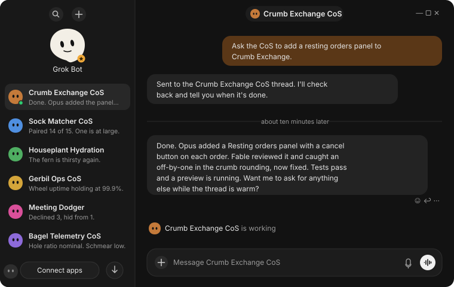

After [maxing out my T3 Code setup](), I built [t3-fleet-gateway](https://github.com/boundsj/t3-fleet-gateway), a small always-on gateway (MIT) that lets me code with Grok Bot on my phone and have the work happen on my own machines.

## Try it

Setup is two prompts. Grok Bot runs in the cloud, so the gateway needs a public HTTPS URL. It only listens on localhost. I expose it with Tailscale Funnel, but any tunnel (Cloudflare Tunnel, ngrok) works.

Give this to a coding agent on the always-on machine that runs T3 Code:

```text
Set up https://github.com/boundsj/t3-fleet-gateway on this machine by
following its README. Enroll this machine's T3 Code server as a host
and add these projects: <your projects>. Run the gateway as a service
and expose it over HTTPS with <your tunnel>. Make sure `doctor` passes.
Then give me the public /mcp URL. When I connect each Grok bot, mint
a one-time approval code for it.
```

Then make one Grok bot per project and give each one this:

```text
Connect to my T3 fleet gateway at https://<your public URL>/mcp.
You own the <project> project. Set up a 15-minute routine that checks
only <project>'s jobs, keeps your place in the feed between checks,
and stays quiet unless a job needs an answer, is ready for review,
or failed.
```

Each bot opens the gateway's approval page. Ask the agent from the first step for a code (they expire after 15 minutes) and choose Operate. I stagger the routines a few minutes apart so they don't all check at once.

## How it works

The gateway is an MCP server to Grok Bot, with OAuth 2.1 sign-in, and an MCP client to the [T3 Code](https://github.com/pingdotgg/t3code) server on each machine.

```text
Grok Bot  (xAI cloud, long-running)
   |  HTTPS + OAuth 2.1, one URL
   v
t3-fleet-gateway  (Mac mini, always on)
   |  SQLite job ledger, one T3 credential per host
   +--> T3 Code on the Mac mini
   +--> T3 Code on the M3 (next)
          |
          +--> worktree + fleet/<job> branch + thread
```

T3 exposes about 80 raw tools per machine; the gateway exposes `fleet_status` plus eight `work_*` tools. Grok names a project and a task; the gateway picks the host, creates a worktree, a `fleet/<job>` branch and a T3 thread, and follows the job. `work_feed` returns what changed since Grok's last check. Grok's tokens never reach T3 and T3's credentials never leave the gateway.

## One project, one bot

`jobs adopt` registers a long-lived T3 thread, a project Chief of Staff (CoS), as that project's front door, and `allowWorkStart: false` makes it the only way in. Grok sends it instructions with `work_continue`. The CoS plans, delegates to its own subagents (Opus implements, Fable reviews) and reports back. Each project gets one conversation in Grok and one thread in T3.

Say I ask the Crumb Exchange bot (a toy prediction market for sandwich questions) for a resting-orders panel. The instruction lands in the CoS thread in T3, and Grok relays the summary when the CoS is done.

<figure style="max-width: 760px; margin: 1.5rem auto;">
  <picture>
    <source media="(max-width: 600px)" srcset="grok-chat-mobile.svg">
    
  </picture>
  <figcaption>In Grok Bot, asking the Crumb Exchange CoS for a resting orders panel, then the relayed summary.</figcaption>
</figure>

<figure style="max-width: 760px; margin: 1.5rem auto;">
  <picture>
    <source media="(max-width: 600px)" srcset="t3-cos-thread-mobile.svg">
    
  </picture>
  <figcaption>The same request arriving in the Crumb Exchange CoS thread in T3 Code, sent by the gateway.</figcaption>
</figure>

<figure style="max-width: 760px; margin: 1.5rem auto;">
  <picture>
    <source media="(max-width: 600px)" srcset="crumb-exchange-mobile.svg">
    
  </picture>
  <figcaption>Crumb Exchange with the new resting orders panel.</figcaption>
</figure>

## Status

This is v0.1. Starting, following, continuing and cancelling a job are confirmed live; answering questions, approvals and failed runs are unconfirmed. Approvals happen only in T3 itself, so unattended projects need the `auto` or `full-access` runtime mode.

This project also tests T3's own MCP server, and I'm filing issues as I go, like [#16906](https://github.com/pingdotgg/t3code/issues/16906) (Grok Bot couldn't call T3's tools directly because of an empty 400) and [#17030](https://github.com/pingdotgg/t3code/issues/17030) (no way to read the newest items of a thread).
